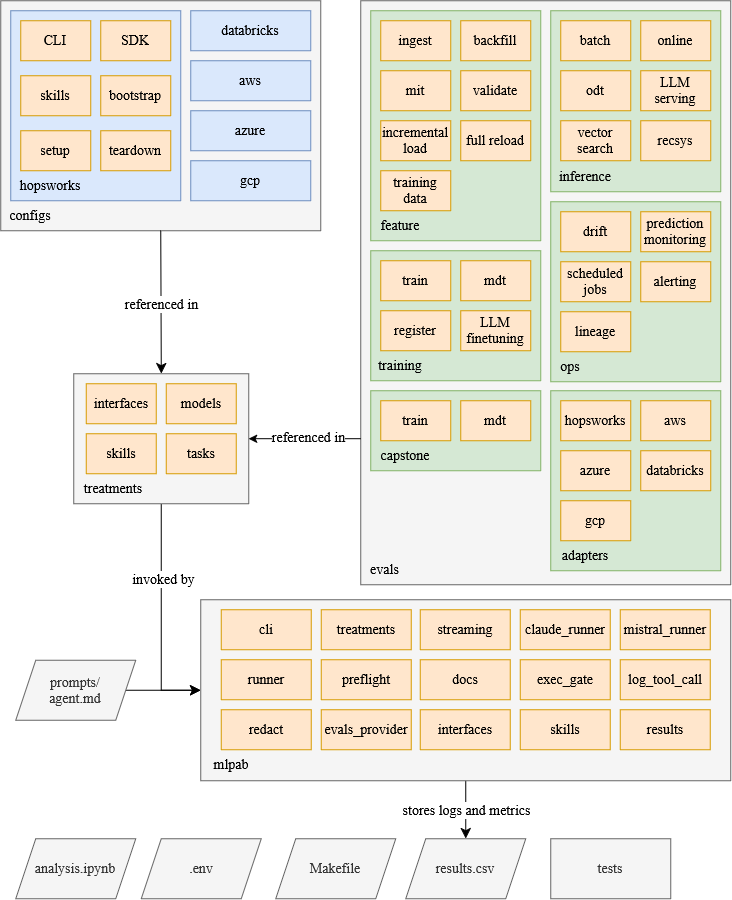

# MLPlatformAgentBench (MLPAB)

MLPlatformAgentBench is a benchmark for evaluating large language model coding
agents on machine learning platform tasks. It measures how the interface given
to the agent, a command-line interface (CLI) or a Python SDK,
affects how well the agent completes those tasks.

> This repository accompanies the KTH master's thesis *MLPlatformAgentBench: Can coding agents optimize machine learning platform interfaces?* The thesis is located in [`docs/thesis/thesis.pdf`](docs/thesis/thesis.pdf).

<p align="center">
  
</p>

## What it measures

Each task is run across a grid of conditions so the conditions can be compared
directly.

- **Platform.** Hopsworks, Databricks, AWS SageMaker, Azure ML, GCP Vertex, and a `local` baseline (`none`).
- **Interface.** The platform CLI or the Python SDK (or `none`).
- **Skills.** With or without a bundle of platform skills (Claude Code slash-commands and docs).
- **Agent engine and model.** `claude-*` (Claude Code), `gpt-*` (Codex), `mistral-*` (Mistral Vibe).

The agent's work is graded by reading the result back through the platform's own
data paths, not by inspecting the agent transcript. Tasks are generated as fresh,
seeded instances of the Feature, Training, and Inference (FTI) lifecycle, plus
Ops and Capstone tasks. Each run uses a new seed, so runs are reproducible but
not identical. The agent runs in a sandbox confined to its run directory and is
restricted to the one interface under test. Per-platform setup and teardown
scripts provision and remove cloud resources around each run.

MLPAB is the testbed for a KTH master's thesis on how interface design and
supporting skills affect agent performance on ML platform operations. The
framework, configs, evals, and results live at the repository root, and the KTH
LaTeX thesis is in `docs/thesis/` (`docs/thesis/thesis.tex`).

## How a run works

1. A treatment config (`configs/treatments/<n>_<name>.yaml`, a numbered flat file) expands into a grid of runs over models, interfaces, skills, and tasks.
2. A session-start check confirms that every platform credential, skill bundle, and model is available and responds to a live probe before any work begins.
3. Each interface is built once and installed into a per-interface prepared virtual environment. Every run then clones that environment read-only, so runs do not reinstall anything or mutate shared state, and parallel sessions do not interfere.
4. For each run: a fresh seeded task instance is generated, `setup.py` provisions the platform and a `verify` step confirms it is ready, the sandboxed agent attempts the task using only its interface, then `teardown.py` removes what the agent created and a `verify` step confirms nothing was left behind.
5. A platform adapter (`evals/adapters/<platform>.py`) reads the deliverable back through the platform and runs the task's assertion suite.
6. One row per run is appended to `results/results.csv`.

### Eval families (`evals/`)

Every task has a documentation page under
[`docs/tasks/`](docs/tasks/README.md), auto-generated from the
task packages with `make task-docs`: the generator's design notes, the literal
seed-1 prompt, the staged files, the assert suite, and the diagnosed naive
variants all come straight from the code, so the pages cannot drift from the
tasks.

| Family | Tasks |
|---|---|
| feature | [`ingest`](docs/tasks/feature/ingest.md), [`backfill`](docs/tasks/feature/backfill.md), [`mit`](docs/tasks/feature/mit.md), [`validate`](docs/tasks/feature/validate.md), [`incremental_load`](docs/tasks/feature/incremental_load.md), [`full_reload`](docs/tasks/feature/full_reload.md), [`pit`](docs/tasks/feature/pit.md) (point-in-time correct), [`leakage`](docs/tasks/feature/leakage.md) |
| training | [`train`](docs/tasks/training/train.md), [`mdt`](docs/tasks/training/mdt.md), [`register`](docs/tasks/training/register.md), [`llm_finetuning`](docs/tasks/training/llm_finetuning.md) |
| inference | [`batch`](docs/tasks/inference/batch.md), [`online`](docs/tasks/inference/online.md), [`odt`](docs/tasks/inference/odt.md), [`skew`](docs/tasks/inference/skew.md), [`llm_serving`](docs/tasks/inference/llm_serving.md), [`recsys`](docs/tasks/inference/recsys.md), [`vector_search`](docs/tasks/inference/vector_search.md) |
| ops | [`drift`](docs/tasks/ops/drift.md), [`prediction_monitoring`](docs/tasks/ops/prediction_monitoring.md), [`scheduled_jobs`](docs/tasks/ops/scheduled_jobs.md), [`alerting`](docs/tasks/ops/alerting.md), [`lineage`](docs/tasks/ops/lineage.md) |
| capstone | [`ccfraud`](docs/tasks/capstone/ccfraud.md), [`airquality`](docs/tasks/capstone/airquality.md) |

### Treatments (`configs/treatments/`)

The committed treatment configs are the experiments behind the thesis results.
Each is a numbered flat yaml; its results live under `results/<n>_<name>/`.

| Treatments | Experiment |
|---|---|
| 1–4 | Hopsworks, full grid (CLI + SDK, with and without skills) across models: Opus, Mistral Large, Sonnet, Mistral Medium |
| 5–10 | Hopsworks CLI optimization arms opt1–opt6 (batch, session-reuse, compact-json, idempotent, quiet, stable-output), Opus, no skills |
| 11 | Hopsworks CLI with an AI-optimized skills bundle, Opus |
| 12–17 | Hopsworks CLI optimization arms opt1–opt6 combined with the optimized skills bundle, Opus |
| 18–21 | Databricks, full grid across models: Opus, Sonnet, Mistral Large, Mistral Medium |
| 22 | GCP Vertex, full grid, Opus |
| 23–24 | Hopsworks and Databricks, full grid, Fable |

## Quickstart

```bash
make install        # create .venv, install mlpab + evals + dev tools, link `mlpab` onto PATH
make setup          # interactive: authenticate agent engine(s) and set up platform(s)

# Verify a config is runnable: platform reachable, and each model answers a live probe
make check CONFIG=configs/treatments/1_hw-full-cli-sdk-skills-opus.yaml

# Run a treatment session in tmux, detached from any terminal
mlpab start configs/treatments/18_db-full-cli-sdk-skills-opus.yaml
mlpab status                # list running sessions
mlpab attach <config.yaml>  # watch live (detach with Ctrl-b d)

# Or run inline
mlpab run configs/treatments/22_gcp-full-cli-sdk-skills-opus.yaml

# Resume: re-running a config skips combos already completed — a valid row whose
# run folder still exists on disk. --retry also re-runs FAILED combos (no valid
# row, or a valid row whose folder was deleted), purging their rows + folders
# and running clean; --no-skip re-runs every combo, accumulating attempts.
mlpab run --retry configs/treatments/18_db-full-cli-sdk-skills-opus.yaml
```

Credentials are read from `.env`. macOS is the primary target. It uses
APFS copy-on-write clones for the per-run virtual environments and the macOS
Keychain for the Claude OAuth token. Other systems fall back to plain copies.

## Development

```bash
make test        # unit tests
make lint        # ruff check plus isort and format checks (no changes)
make fmt         # auto-fix: isort imports, then ruff format, then ruff --fix
```

## Results

```
results/results.csv     one row per run (the single results table)
results/<config>/...    per-run artifacts: agent.log, submission/, grading, commands
results/*.ipynb         hand-curated analysis notebooks
```

Each row records the identity of the cell (`model`, `platform`, `interface`,
`version`, `skills`, `category`, `task`, `n`) and its outcome (`valid`,
`success`, `asserts_passed`, `asserts_total`), along with cost, latency, and the
agent's tool-call counts. This is enough to reproduce and compare any value in
the table.

## Adding a platform interface

A platform lives in `configs/platforms/<platform>/`. It has one flat manifest per
interface (`cli.yaml`, `sdk.yaml`) describing how to build, install,
authenticate, and test that interface. It also has `setup.py` and `teardown.py`
(each supporting a `verify` mode) and a `skills/` bundle. A matching grader
adapter goes in `evals/adapters/<platform>.py` and implements the read-back
contract (`get_feature_table`, `read_rows`, `read_training_dataset`, and the
state reads).
